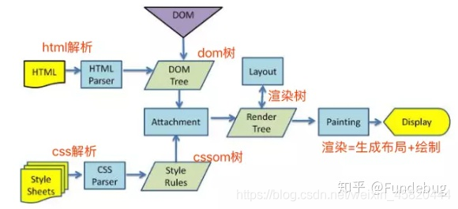

# 浏览器渲染机制

## 浏览器工作大体流程  

  渲染引擎首先通过网络获得所请求文档的内容，通常以8K分块的方式完成。  
下面是渲染引擎在取得内容之后的基本流程：  
  1. 解析html为dom树，解析css为cssom：渲染引擎开始解析html，并将标签转化为内容树中的dom节点。  
  2. 把dom和cssom结合起来生成渲染树(render)：它解析外部CSS文件及style标签中的样式信息。这些样式信息以及html中的可见性指令将被用来构建另一棵树——render树。Render树由一些包含有颜色和大小等属性的矩形组成，它们将被按照正确的顺序显示到屏幕上。  
  3. 布局渲染树，计算几何形状：Render树构建好了之后，将会执行布局过程，它将确定每个节点在屏幕上的确切坐标。  
  4. 把渲染树展示到屏幕上：再下一步就是绘制，即遍历render树，并使用UI后端层绘制每个节点。

浏览器要解析的三样东西：  
1. 一个是HTML/SVG/XHTML，事实上，Webkit有三个C++的类对应这三类文档。解析这三种文件会产生一个DOM Tree。  
2. CSS，解析CSS会产生CSS规则树。  
3. Javascript，脚本，主要是通过DOM API和CSSOM API来操作DOM Tree和CSS Rule Tree。  




## 什么是DOM树？  
  
  浏览器将HTML解析成树形的数据结构，简称DOM。  
DOM 是文档对象模型 (Document Object Model) 的缩写。它是 HTML 文档的对象表示，同时也是外部内容（例如 JavaScript）与 HTML 元素之间的接口。 解析树的根节点是Document对象。  

你还可以这样理解 dom 树：  
  1. DOM树揭示了DOM对象之间的层次关系，这样就方便动态地对html文档进行增删改查。  
  2. 增删改查必须要遵循层次关系  
  3. 文本对象是最底层的节点  
  4. 获取 对象的值 .value  

## 构造DOM树

字节数据 => 字符串 => Token => Node => DOM  
浏览器从磁盘或网络读取HTML的原始字节，并根据文件的指定编码（例如 UTF-8）将它们转换成字符串。 
  在网络中传输的内容其实都是 0 和 1 这些字节数据。当浏览器接收到这些字节数据以后，它会将这些字节数据转换为字符串，也就是我们写的代码。 
  将字符串转换成Token，例如：、等。Token中会标识出当前Token是“开始标签”或是“结束标签”亦或是“文本”等信息。
  事实上，构建DOM的过程中，不是等所有Token都转换完成后再去生成节点对象，而是一边生成Token一边消耗Token来生成节点对象。换句话说，每个Token被生成后，会立刻消耗这个Token创建出节点对象。注意：带有结束标签标识的Token不会创建节点对象。  


## 什么是CSS树

CSSOM，即CSS Object Model，CSS对象模型，是对CSS样式表的对象化表示，同时还提供了相关API用来操作CSS样式。  
在W3C标准中，CSSOM包含两部分：  
  1. Model：描述样式表和规则的模型部分；  
    1.1 Model部分是CSSOM的本体，通常都是用HTML标签style或者link标签即可创建  
    1.2 在构建CSSOM树时，对于任何一个元素的最终样式，浏览器都会从适用于该节点的最上层节点开始，通过递归的方式不断向下合并更加具体的规则，最终得出完整的结果，这就是向下级联(Cascade)的含义。  
  2. View：和元素视图相关的API部分。  
    2.1 这部分内容可分成三个部分：窗口部分，滚动部分和布局部分。
  


## 构建CSSOM

构建CSSOM的过程和构建DOM的过程类似，但前者要依赖后者，因为只有HTML内容具有完整的树形结构关系，而CSS样式表并没有。  
具体而言，在构建CSSOM树时，对于任何一个元素的最终样式，浏览器都会从适用于该节点的最上层节点开始，通过递归的方式不断向下合并更加具体的规则，最终得出完整的结果，这就是向下级联(Cascade)的含义。  

## 什么是渲染树(render树)？  

  浏览器在构造DOM树的同时也在构造着另一棵树-Render Tree,与DOM树相对应暂且叫它Render树。它的主要作用就是把HTML按照一定的布局与样式显示出来，用到了CSS的相关知识。  

  从中我们可以发现renderer包含了一个dom对象以及为其计算好的样式规则，提供了布局以及显示方法。具体效果图如下：（firefox的Frames对应renderers,content对应dom）
  
  具体显示的时候，每一个renderer体现了一个矩形区块的东西，即我们常说的CSS盒子模型的概念，它本身包含了一些几何学相关的属性，如宽度width，高度height，位置position等。
  
## 构建渲染树
当我们生成 DOM 树和 CSSOM 树以后，就需要将这两棵树组合为渲染树。

  

关键的点在于上述的4个过程并不是以严格顺序执行的。渲染引擎会以最快的速度展示内容，所以第二阶段不会等到第一阶段结束才开始，而是在第一阶段有输出的时候就开始执行。其它阶段也是如此。由于浏览器会尝试尽快展示内容，所以内容有时会在样式还没有加载的时候展示出来。

  这就是经常发生的FOCU(flash of unstyled content)或白屏问题。

## 布局与绘制
当浏览器生成渲染树以后，就会根据渲染树来进行布局（也可以叫做回流）。这一阶段浏览器要做的事情是要弄清楚各个节点在页面中的确切位置和大小。通常这一行为也被称为“自动重排”。

  布局流程的输出是一个“盒模型”，它会精确地捕获每个元素在视口内的确切位置和尺寸，所有相对测量值都将转换为屏幕上的绝对像素。

  布局完成后，浏览器会立即发出“Paint Setup”和“Paint”事件，将渲染树转换成屏幕上的像素。

## 渲染过程中遇到JS文件怎么处理？
  
  JavaScript的加载、解析与执行会阻塞DOM的构建，也就是说，在构建DOM时，HTML解析器若遇到了JavaScript，那么它会暂停构建DOM，将控制权移交给JavaScript引擎，等JavaScript引擎运行完毕，浏览器再从中断的地方恢复DOM构建。

  也就是说，如果你想首屏渲染的越快，就越不应该在首屏就加载 JS 文件，这也是都建议将 script 标签放在 body 标签底部的原因。当然在当下，并不是说 script 标签必须放在底部，因为你可以给 script 标签添加 defer 或者 async 属性（下文会介绍这两者的区别）。

  JS文件不只是阻塞DOM的构建，它会导致CSSOM也阻塞DOM的构建。

  原本DOM和CSSOM的构建是互不影响，井水不犯河水，但是一旦引入了JavaScript，CSSOM也开始阻塞DOM的构建，只有CSSOM构建完毕后，DOM再恢复DOM构建。

  这是什么情况？

  这是因为JavaScript不只是可以改DOM，它还可以更改样式，也就是它可以更改CSSOM。前面我们介绍，不完整的CSSOM是无法使用的，但JavaScript中想访问CSSOM并更改它，那么在执行JavaScript时，必须要能拿到完整的CSSOM。所以就导致了一个现象，如果浏览器尚未完成CSSOM的下载和构建，而我们却想在此时运行脚本，那么浏览器将延迟脚本执行和DOM构建，直至其完成CSSOM的下载和构建。也就是说，在这种情况下，浏览器会先下载和构建CSSOM，然后再执行JavaScript，最后在继续构建DOM。

## 回流和重绘

重绘：  
  当元素属性发生改变且不影响布局时（背景颜色、透明度、字体样式等），产生重绘，相当于不刷新页面，动态更新内容。  
回流：  
  当元素属性发生改变且影响布局时（宽度、高度、内外边距等），产生回流，相当于刷新页面。  
```
重绘不一定引起回流，回流必将引起重绘
```
### 如何减少回流和重绘？
  
1. 使用 transform 替代 top  
2. 使用 visibility 替换 display: none ，因为前者只会引起重绘，后者会引发回流（改变了布局）  
3. 不要使用 table 布局，可能很小的一个小改动会造成整个 table 的重新布局  
4. 动画实现的速度的选择，动画速度越快，回流次数越多，也可以选择使用requestAnimationFrame  
5. CSS 选择符从右往左匹配查找，避免节点层级过多  
6. 将频繁重绘或者回流的节点设置为图层，图层能够阻止该节点的渲染行为影响别的节点。比如对于 video 标签来说，浏览器会自动将该节点变为图层  

## 如何理解虚拟DOM树提高效率
```
官网概念：通过建立一个虚拟DOM树对真实DOM发生的变化保持追踪。
```
在react/vue 等技术出现之前，我们要改变页面展示的内容只能通过变量查询DOM树来找到对应的DOM节点，修改节点样式、行为或者结果，来达到更新ui的目的。这种方式是很消耗计算资源的，因为每次找到DOM节点都要遍历DOM树。  

如果我们建立与DOM节点对应的DOM对象（JS对象），以对象嵌套的方式来表示 DOM 树，那么每次 DOM 的更改就变成了JS 对象的属性的更改，这样一来就能查找 JS对象的属性变化要比查询 DOM 树的性能开销小。

为什么DOM树的性能开销大？

1. DOM树的实现模块和JS模块是分开的，这些跨模块通讯增加了成本  
2. DOM操作引起的浏览器回流和重绘，使得性能开销巨大。

### 新技术是如何解决性能问题的

思想是每次更新DOM都尽量不要去刷新整个页面，而是有针对性的去刷新被更改的那部分，来释放掉被无效渲染占用的CPU，GPU的性能。  

虚拟DOM树只会重新渲染页面修改的地方，大大减少了对真实DOM树的操作。可以这样理解，虚拟DOM树是用空间(虚拟DOM树占空间)换时间(虚拟DOM树可以提高DOM效率)。

### async 和 defer  
1. ```<script src="script.js"></script>```

没有 defer 或 async，浏览器会立即加载并执行指定的脚本，“立即”指的是在渲染该 script 标签之下的文档元素之前，也就是说不等待后续载入的文档元素，读到就加载并执行。

2. ```<script async src="myscript.js"></script>```

有 async，加载和渲染后续文档元素的过程将和 script.js 的加载与执行并行进行（异步）。

3. ```<script defer src="myscript.js"></script>```

有 defer，加载后续文档元素的过程将和 script.js 的加载并行进行（异步），但是 script.js 的执行要在所有元素解析完成之后，DOMContentLoaded 事件触发之前完成。

 

此图告诉我们以下几个要点:  
1. defer 和 async 在网络读取（下载）这块儿是一样的，都是异步的（相较于 HTML 解析）
2. 它俩的差别在于脚本下载完之后何时执行，显然 defer 是最接近我们对于应用脚本加载和执行的要求的
3. 关于 defer，此图未尽之处在于它是按照加载顺序执行脚本的，这一点要善加利用
4. async 则是一个乱序执行的主，反正对它来说脚本的加载和执行是紧紧挨着的，所以不管你声明的顺序如何，只要它加载完了就会立刻执行
5. async 对于应用脚本的用处不大，因为它完全不考虑依赖（哪怕是最低级的顺序执行），不过它对于那些可以不依赖任何脚本或不被任何脚本依赖的脚本来说却是非常合适的


## 参考链接  
 - [CSS对象模型CSSOM是什么？](https://www.jianshu.com/p/7c3e2493c7a7)
 - [Dom树 CSS树 渲染树(render树) 规则、原理](https://blog.csdn.net/weixin_45820444/article/details/109013996)
 - [如何理解虚拟DOM树提高效率](https://blog.csdn.net/weixin_39854011/article/details/108448596)
 - [defer和async的区别](https://segmentfault.com/q/1010000000640869)